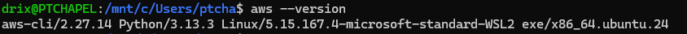
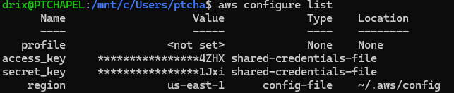
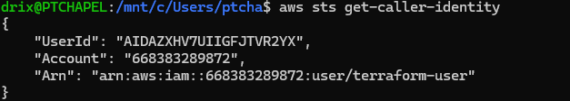
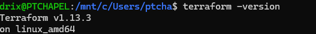
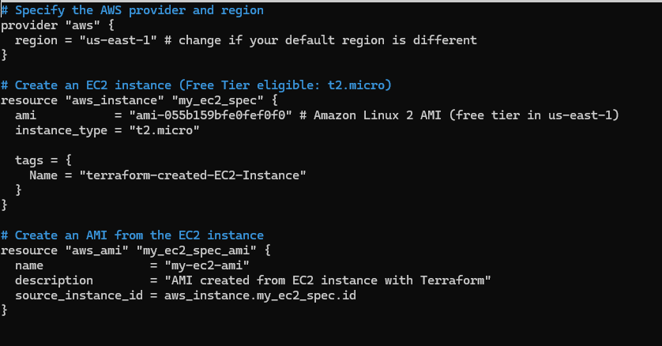
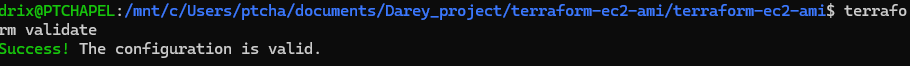
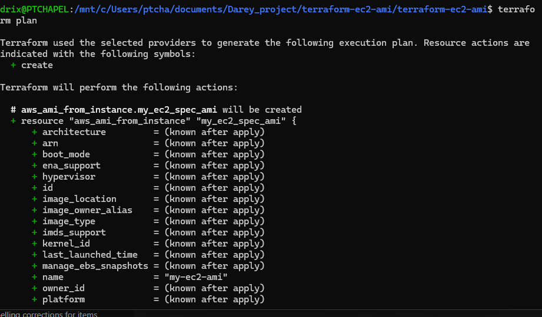
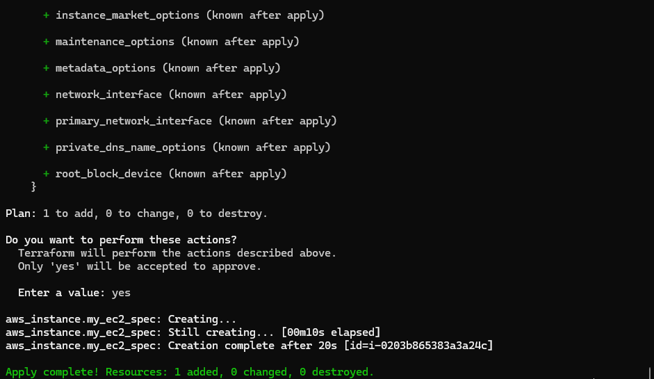
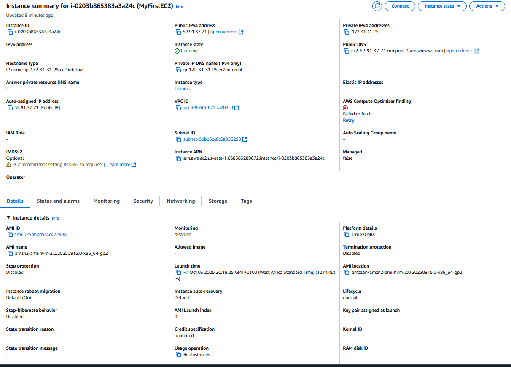

# Terraform EC2 Instance and AMI Creation

This mini project demonstrates how to use Terraform to automate the creation of an EC2 instance on AWS and then create an Amazon Machine Image (AMI) from that instance.  

---

## 🎯 Objectives
- Write basic Terraform configuration files.
- Automate creation of an EC2 instance using Terraform.
- Automate creation of an AMI from an already created EC2 instance.
---

## 📌 Tasks Outline
1. Confirm Prerequisites  
2. Write the Terraform Script  
3. Execute the Script  
   - `terraform init`  
   - `terraform validate`  
   - `terraform plan`  
   - `terraform apply`  
4. Confirm Resources  
5. Clean up with `terraform destroy`  

---

## 🚀 Task 1: Confirm the Prerequisites

- Login to your AWS account.
- Check AWS CLI version:

```bash
aws --version
````



* Confirm AWS CLI configuration:

```bash
aws configure list
```



* Verify AWS CLI authentication:

```bash
aws sts get-caller-identity
```



* Check Terraform installation:

```bash
terraform --version
```



---

## 🚀 Task 2: Develop the Terraform Script

* Create a new project directory:

```bash
mkdir terraform-ec2-ami && cd terraform-ec2-ami
```

* Create a Terraform configuration file:

```bash
nano main.tf
```


---

## 🚀 Task 3: Execute the Terraform Script

* Initialize Terraform:

```bash
terraform init
```


* Validate script correctness:

```bash
terraform validate
```



* Preview resources to be created:

```bash
terraform plan
```



* Apply the configuration:

```bash
terraform apply
```



---

## 🚀 Task 4: Confirm Resources

* In AWS Console:

  * Confirm EC2 instance creation.
  * Confirm AMI creation.



---

## 🚀 Task 5: Clean Up

Always destroy resources to avoid charges:

```bash
terraform destroy
```


---

## 📝 Observations & Challenges

During the project, I initially faced errors with AWS authentication since I had no IAM user configured. This was resolved by creating an IAM user, generating access/secret keys, and configuring them with aws configure. I also encountered issues with an invalid AMI ID and free-tier ineligible instance types. These were resolved by using a Terraform data source to dynamically fetch the latest Amazon Linux 2 AMI and updating the script to use the free-tier eligible t2.micro instance. Additionally, I corrected script errors such as using unsupported arguments by replacing them with the proper resource type. Overall, these challenges helped me better understand how to link Terraform with AWS, handle errors, and ensure resources remain within the free tiery

---

## ✅ Summary

In this project, we:

* Automated creation of an EC2 instance using Terraform.
* Created an AMI from the instance.
* Practiced Terraform workflow: `init`, `validate`, `plan`, `apply`, and `destroy`.
* Ensured AWS free tier compliance by destroying resources after use.
