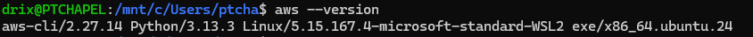
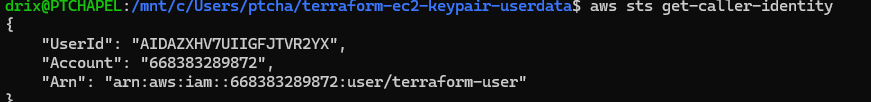
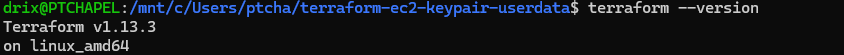
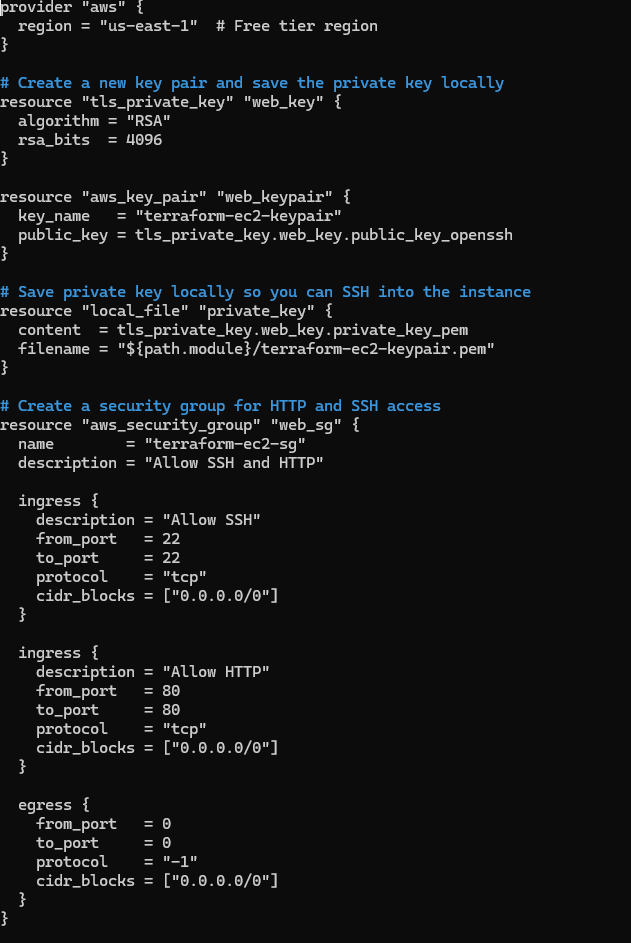
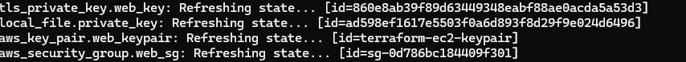
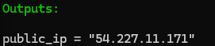
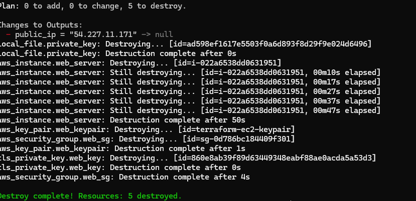

## 📘 Project Overview

In this mini project, I used Terraform to automate the creation of an EC2 instance on AWS, generate a downloadable key pair, and execute a user data script that installs and configures the Apache HTTP server. The setup ensures the web server automatically displays a “Hello World” message upon successful launch.

---

## 🎯 Objectives

* Automate EC2 instance creation using Terraform
* Generate and download a secure key pair for SSH access
* Configure an Apache web server automatically using a user data script

---

## ⚙️ Project Setup

### Step 1 — Create Project Directory

```bash
mkdir terraform-ec2-keypair-userdata
cd terraform-ec2-keypair-userdata
```

### Step 2 — Verify Prerequisites

Run the following commands and confirm outputs:

* `aws --version` → 
* `aws sts get-caller-identity` → 
* `terraform --version` → 

---

## 🧱 Step 3 — Terraform Configuration

Create a file named **`main.tf`** see screenshots below: 



---

## 💻 Step 4 — Add User Data Script

Create a new file named **`user_data.sh`**:

```bash
#!/bin/bash
sudo yum update -y
sudo yum install -y httpd
sudo systemctl start httpd
sudo systemctl enable httpd
echo "Hello World from Terraform Apache Server" | sudo tee /var/www/html/index.html
```

---

## ⚡ Step 5 — Initialize and Apply Terraform

```bash
terraform init
terraform validate
terraform plan
terraform apply -auto-approve
```

### Expected Output

* Terraform initializes and provisions resources → 
* Private key file `terraform-keypair.pem` is generated locally → 
* Terraform outputs the EC2 public IP → 

---

## 🌐 Step 6 — Verify Apache Web Server

Copy the **public IP** from the Terraform output and visit in your browser:

```
http://<public-ip>
```

Expected page output:
**“Hello World”** → 

---

## 🧹 Step 7 — Clean Up Resources

To avoid AWS charges, destroy all resources:

```bash
terraform destroy -auto-approve
```



---

## 📝 Observations and Challenges

During this project, I learned how to automate EC2 provisioning using Terraform with key pairs and user data scripts. Initially, I encountered errors related to invalid AMI IDs and non–free-tier instance types, which I resolved by listing available AMIs in my region and selecting a valid Amazon Linux 2 free-tier image. I also noticed that the web page displayed the instance hostname instead of my custom message, which I later fixed by editing the user data script. Overall, the project helped me understand Terraform’s automation flow—from configuration to deployment, troubleshooting, and verification on AWS.
