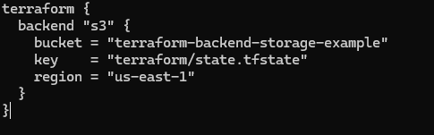

# Terraform Modules – VPC and S3 Bucket with Backend Storage

## 🧩 Purpose
This mini project demonstrates how to use **Terraform modules** to create an **Amazon VPC** and an **S3 bucket**, while configuring **Terraform remote backend** to store the state file securely in the S3 bucket.

---

## 🎯 Objectives
- **Terraform Modules:** Create reusable modules for VPC and S3 bucket.  
- **VPC Creation:** Define a customizable VPC using Terraform modules.  
- **S3 Bucket Creation:** Define a module for S3 bucket creation with flexible configurations.  
- **Backend Storage Configuration:** Configure Terraform to store state remotely in an S3 bucket.

---

## 🧱 Project Structure
```

terraform-modules-vpc-s3/
│
├── main.tf
├── backend.tf
├── variables.tf
├── outputs.tf
│
└── modules/
├── vpc/
│   ├── main.tf
│   ├── variables.tf
│   └── outputs.tf
│
└── s3/
├── main.tf
├── variables.tf
└── outputs.tf

```

## ⚙️ Step-by-Step Implementation

### 🪜 Step 1: Create Project Directory
```bash
mkdir terraform-modules-vpc-s3
cd terraform-modules-vpc-s3
mkdir -p modules/vpc modules/s3
```


---

### 🪜 Step 2: Create the VPC Module

**File:** `modules/vpc/main.tf`

```hcl
resource "aws_vpc" "main_vpc" {
  cidr_block           = var.vpc_cidr
  enable_dns_support   = true
  enable_dns_hostnames = true
  tags = {
    Name = var.vpc_name
  }
}
```

**File:** `modules/vpc/variables.tf`

```hcl
variable "vpc_cidr" {}
variable "vpc_name" {}
```

**File:** `modules/vpc/outputs.tf`

```hcl
output "vpc_id" {
  value = aws_vpc.main_vpc.id
}
```


---

### 🪜 Step 3: Create the S3 Module

**File:** `modules/s3/main.tf`

```hcl
resource "aws_s3_bucket" "main_bucket" {
  bucket = var.bucket_name
  acl    = var.bucket_acl
  tags = {
    Name = var.bucket_name
  }
}
```

**File:** `modules/s3/variables.tf`

```hcl
variable "bucket_name" {}
variable "bucket_acl" {
  default = "private"
}
```

**File:** `modules/s3/outputs.tf`

```hcl
output "bucket_arn" {
  value = aws_s3_bucket.main_bucket.arn
}
```


---

### 🪜 Step 4: Create the Main Terraform Configuration

**File:** `main.tf`

```hcl
provider "aws" {
  region = "us-east-1"
}

module "vpc" {
  source   = "./modules/vpc"
  vpc_cidr = "10.0.0.0/16"
  vpc_name = "terraform-vpc"
}

module "s3" {
  source      = "./modules/s3"
  bucket_name = "terraform-backend-storage-example"
  bucket_acl  = "private"
}
```


---

### 🪜 Step 5: Configure Terraform Backend

**File:** `backend.tf`

```hcl
terraform {
  backend "s3" {
    bucket = "terraform-backend-storage-example"
    key    = "terraform/state.tfstate"
    region = "us-east-1"
  }
}
```



---

### 🪜 Step 6: Initialize Terraform

```bash
terraform init
```

✅ This command initializes the project, downloads modules, and configures the remote backend.


---

### 🪜 Step 7: Apply Configuration

```bash
terraform apply
```

Confirm with **yes** when prompted.
Terraform will create the VPC and S3 bucket and store the state file in the S3 backend.


---

### 🪜 Step 8: Verify Resources in AWS Console

* **VPC:** Go to the **VPC Dashboard** → You’ll see `terraform-vpc`.
* **S3 Bucket:** Go to the **S3 Console** → You’ll see your `terraform-backend-storage-example` buckett

---

## 🧾 Observations and Challenges

During this project, one challenge encountered was configuring the backend before the S3 bucket existed, which caused Terraform initialization errors. To resolve it, the S3 bucket was created first locally and then referenced in the backend configuration. Another key learning was structuring Terraform code using **modules** to enhance **reusability and scalability** for larger infrastructure projects.

---

## 🧹 Cleanup

To avoid charges, destroy all resources after verification:

```bash
terraform destroy
```


---

## 🏁 Summary

This project demonstrated how to:

* Use **Terraform modules** for modular infrastructure.
* Create **VPC** and **S3 bucket** resources.
* Configure **remote backend** storage for Terraform state.
* Manage resources efficiently within the AWS free tier.
