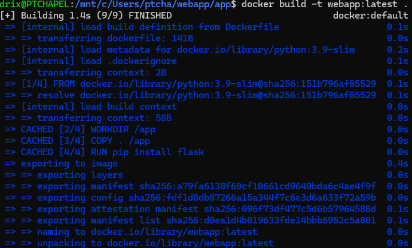
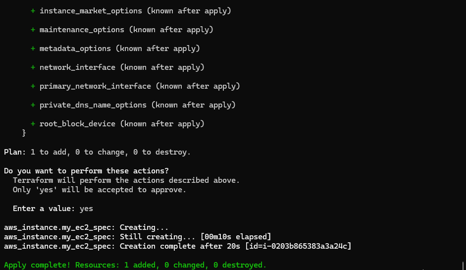
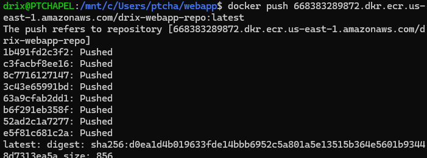
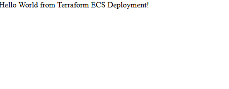

# Terraform ECS Web App Deployment with Docker and ECR

## **Project Title:**  
**Hosting a Dynamic Web Application on AWS with Terraform Modules, Docker, Amazon ECR, and ECS**

---

## **Purpose**
This project demonstrates how to deploy a dynamic, containerized web application on AWS using Terraform modules for infrastructure provisioning. 

---

## **Objectives**
- **Terraform Module Creation:** Learn how to modularize Terraform configurations for reusability and cleaner architecture.
- **Dockerization:** Understand how to containerize a web application and ensure it runs uniformly across environments.
- **Amazon ECR Configuration:** Create a private container registry to store and manage Docker images.
- **Amazon ECS Deployment:** Deploy the Dockerized application using ECS, enabling scalable and reliable hosting.

---

## **Step-by-Step Implementation**

### **Task 1: Dockerization of Web App**
1. Create a simple dynamic web application (Flask example below):
   ```python
   # app/main.py
   from flask import Flask
   app = Flask(__name__)

   @app.route('/')
   def hello():
       return "Hello World from Terraform ECS Deployment!"

   if __name__ == '__main__':
       app.run(host='0.0.0.0', port=80)

2. Write a Dockerfile to containerize the app:

   ```dockerfile
   FROM python:3.9-slim
   WORKDIR /app
   COPY . /app
   RUN pip install flask
   EXPOSE 80
   CMD ["python", "main.py"]
   ```
3. Build and test locally:

   ```bash
   docker build -t webapp:latest .
   docker run -p 80:80 webapp:latest
   ```

   
Ad
---

### **Task 2: Terraform Module for Amazon ECR**

**`modules/ecr/main.tf`**

```hcl
resource "aws_ecr_repository" "webapp_repo" {
  name = var.repo_name
  image_tag_mutability = "MUTABLE"
  image_scanning_configuration {
    scan_on_push = true
  }
}

output "repository_url" {
  value = aws_ecr_repository.webapp_repo.repository_url
}
```

**`modules/ecr/variables.tf`**

```hcl
variable "repo_name" {
  description = "The name of the ECR repository"
  type        = string
}
```
**`modules/ecr/outputs.tf`**

```hcl
output "repository_url" {
  value = aws_ecr_repository.repo.repository_url
}
```
---

### **Task 3: Terraform Module for Amazon ECS**

**`modules/ecs/main.tf`**

```hcl
resource "aws_ecs_cluster" "web_cluster" {
  name = var.cluster_name
}

resource "aws_ecs_task_definition" "web_task" {
  family                   = var.task_family
  network_mode              = "awsvpc"
  requires_compatibilities  = ["FARGATE"]
  cpu                       = "256"
  memory                    = "512"
  execution_role_arn        = var.execution_role_arn
  container_definitions     = jsonencode([
    {
      name      = "webapp"
      image     = var.container_image
      essential = true
      portMappings = [
        {
          containerPort = 80
          hostPort      = 80
        }
      ]
    }
  ])
}

resource "aws_ecs_service" "web_service" {
  name            = var.service_name
  cluster         = aws_ecs_cluster.web_cluster.id
  task_definition = aws_ecs_task_definition.web_task.arn
  desired_count   = 1
  launch_type     = "FARGATE"

  network_configuration {
    subnets          = var.subnets
    assign_public_ip = true
    security_groups  = var.security_groups
  }
}

output "ecs_cluster_name" {
  value = aws_ecs_cluster.web_cluster.name
}
```
**`modules/ecs/variables.tf`**

```hcl
variable "cluster_name" { type = string }
variable "task_family"  { type = string }
variable "service_name" { type = string }
variable "container_image" { type = string }
variable "subnets" { type = list(string) }
variable "security_groups" { type = list(string) }
variable "desired_count" { type = number default = 0 } # start at 0
variable "cpu" { type = string default = "256" }
variable "memory" { type = string default = "512" }
variable "assign_public_ip" { type = bool default = true }
variable "region" { type = string default = "us-east-1" }
```

**`modules/ecs/outputs.tf`**

```hcl
output "cluster_id" { value = aws_ecs_cluster.cluster.id }
output "service_name" { value = aws_ecs_service.service.name }
```
---

### **Task 4: Main Terraform Configuration**

**`main.tf`**

```hcl
provider "aws" {
  region = "us-east-1"
}

module "ecr" {
  source    = "./modules/ecr"
  repo_name = "drix-webapp-repo"
}

module "ecs" {
  source           = "./modules/ecs"
  cluster_name     = "drix-ecs-cluster"
  task_family      = "drix-web-task"
  service_name     = "drix-web-service"
  container_image  = "${module.ecr.repository_url}:latest"
  execution_role_arn = "arn:aws:iam::123456789012:role/ecsTaskExecutionRole"
  subnets          = ["subnet-abc123"]
  security_groups  = ["sg-abc123"]
}
```

Initialize and apply:

```bash
terraform init
terraform plan
terraform apply
```




This creates the ECR repo, ECS cluster, task execution role, and a service with desired_count = 0 (no Fargate tasks running yet).

Get the ECR repository URL from Terraform output:

```bash
terraform output -raw ecr_repo
```


### **Task 5: Deployment**

1.Build locally

   ```bash
  docker build -t webapp:latest .
   ```

   

2. Get ECR repo URL (from step above), then authenticate and push:

   ```bash
    REPO_URL=$(terraform output -raw ecr_repo)
    aws ecr get-login-password --region us-east-1 | docker login --username AWS --password-stdin ${REPO_URL}
    docker tag webapp:latest ${REPO_URL}:latest
    docker push ${REPO_URL}:latest
   ```

   

3. Reapply Terraform to deploy ECS service:

   ```bash
   terraform apply
   ```

4. Access your web app using the ECS service’s public endpoint.
   

---

## **Observations and Challenges**

During the implementation, the key challenges included configuring IAM roles for ECS tasks and ensuring proper subnet and security group assignments for Fargate networking. Additionally, the ECR push required authentication, which was resolved by using the AWS CLI login command. Once the setup was properly configured, Terraform handled the provisioning seamlessly, demonstrating the power of infrastructure automation for container-based deployments.

---

## **Cleanup**

To avoid unnecessary AWS charges, destroy all created resources:

```bash
terraform destroy
```

Ensure the ECR repository and ECS cluster are fully deleted before exiting your AWS account.

